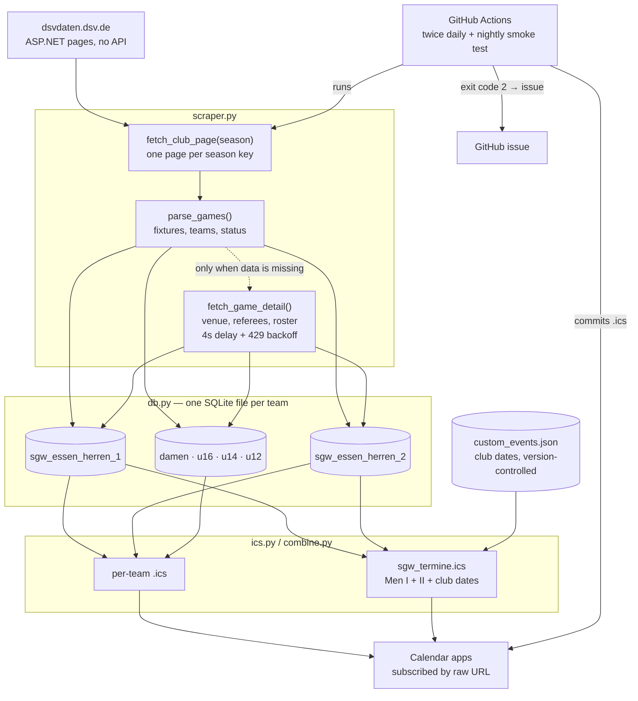

# Architecture

## Data flow



## Modules

| Module | Responsibility |
|---|---|
| `config.py` | Endpoints, club id, and the season arithmetic that decides which DSV seasons to scrape |
| `scraper.py` | Everything that touches the network or raw HTML. Nothing else in the project parses markup |
| `db.py` | Schema, idempotent upserts, and the health queries the run report is built on |
| `ics.py` | RFC 5545 rendering for a single team |
| `combine.py` | The default calendar: Men I + II plus hand-maintained club dates |
| `main.py` | Orchestration, run report, exit codes. Holds no parsing or SQL of its own |

## Design decisions

### One SQLite file per team, not one shared database

Teams are scraped, rendered and subscribed independently. Separate files mean a
broken parse for one age group cannot corrupt another team's calendar, and each
`.ics` can be rebuilt without touching the rest. The cost — no cross-team joins —
never mattered, because the only cross-team artefact is the combined calendar,
which `combine.py` assembles by reading two files.

### Empty values never overwrite stored ones

The club page lists fixtures without venues, referees or scores; only the detail
page has those. A naive `ON CONFLICT DO UPDATE SET col = excluded.col` therefore
erases detail data on every rerun. Upserts now keep the stored value whenever the
incoming one is `NULL` or empty.

This also protects against an upstream quirk: when the DSV re-grades a fixture
(a 10:0 forfeit, say) it strips the date from the record. Preserving the last
known date keeps the entry in subscribers' calendars instead of making it vanish.

### Detail pages are fetched only when something is missing

Each detail page is one throttled request. Refetching all of them on every run
cost 74 requests twice a day for data that almost never changes. `db.needs_detail`
skips a fixture whose venue and result are already stored and whose date has
passed; anything upcoming, unfinished or unknown is still refetched, because the
DSV edits fixtures freely.

### Two season keys during the changeover

A DSV season key is its starting year: `2025` means 2025/2026. Seasons begin in
August, but cup fixtures of the outgoing season can be scheduled into September or
October of the following calendar year. Between August and October both keys are
scraped and merged; DSV game ids are unique, so the upsert deduplicates.

Hardcoding a single season is what silently emptied this calendar in July 2026:
the pipeline kept scraping a finished season and published a calendar with no
future entries, and nothing complained.

### Silence is treated as failure

A scraper that runs cleanly and produces nothing is the dangerous case — exit code
`0`, green run, dead calendar. `main.py` therefore ends with a report of fixtures,
calendar entries, upcoming games and undated games, and exits `2` when no team has
a single upcoming fixture. The scheduled workflow turns that into a GitHub issue,
and a nightly live test against the real DSV catches HTML changes before the next
scheduled run publishes a broken calendar.

### Club dates are version-controlled, databases are not

Dates that exist nowhere in the DSV data — team meetings, training start, referee
courses — live in `custom_events.json` at the repository root. They used to live
in a SQLite file under the gitignored `output/` directory, which worked as long as
the calendar was built on the one machine that had it. The first scheduled run on
a clean runner could not see the file and silently republished the calendar
without those four entries. Anything the automation must preserve has to be
visible to the automation.

### Generated calendars are committed

`.ics` files are build artefacts, and committing build artefacts is usually wrong.
Here it is the delivery mechanism: subscribers point their calendar apps at the raw
GitHub URL, so the file in the repository *is* the product. Databases stay out of
version control — they are rebuildable from the DSV at any time.

## Testing

The suite runs offline against real DSV pages captured on 2026-08-24 and checked
into `tests/fixtures/`. That keeps it deterministic and fast, and it means the test
run never adds load to a third party's server.

Calendars are verified by parsing the output back with the `icalendar` library
rather than by string matching, so RFC 5545 violations that clients would reject
(missing `VTIMEZONE`, wrong line endings, unescaped commas) fail the build.

Three tests marked `live` hit the real portal. They are excluded from the default
run and executed nightly by their own workflow.

## Operations

| Concern | Where |
|---|---|
| Twice-daily scrape and commit | `.github/workflows/update-calendar.yml` |
| Tests and lint on every push | `.github/workflows/tests.yml` |
| Nightly live check against the DSV | `.github/workflows/live-smoke.yml` |
| Alarms | GitHub issue labelled `scrape-alarm`, deduplicated to one open issue |

Automation commits as `SGW Bot <bot@sgw-essen.local>`, which keeps machine commits
visually distinct from human ones.

### Fallback: running the scraper on a server

Before GitHub Actions, this ran from a server crontab via `run_scraper.sh`, which
is still in the repository and still works. To go back to it:

```bash
crontab -e
# 15 10 * * * /bin/bash ~/sgw-calendar/run_scraper.sh >> ~/sgw-calendar/scraper.log 2>&1
# 15 22 * * * /bin/bash ~/sgw-calendar/run_scraper.sh >> ~/sgw-calendar/scraper.log 2>&1
```

The script creates its own virtualenv on first run, pulls before scraping and
pushes only when a calendar actually changed. Disable the GitHub Actions schedule
first — otherwise both would push to the same branch.
